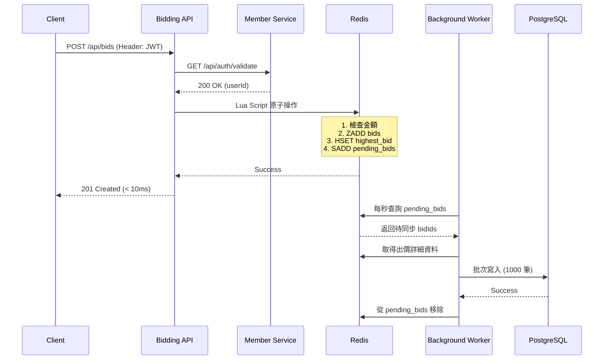
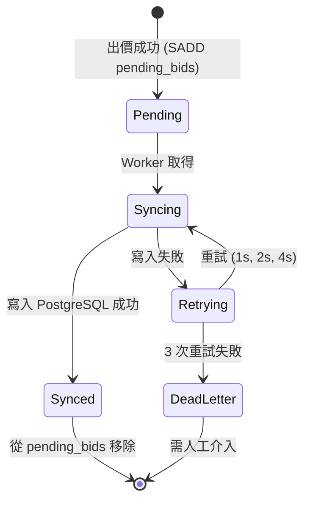

# 資料模型 (Data Model)

**功能**: 競標服務 (Bidding Service)  
**日期**: 2025-12-03  
**狀態**: Phase 1 Design

---

## 概述 (Overview)

本文檔定義 Bidding Service 的資料模型，包括實體、值物件、關聯關係、驗證規則和狀態轉換。

**設計原則**:
- Entity Framework Core 10 Code First 工作流程
- Domain-Driven Design (DDD) 實踐
- PostgreSQL 作為主要持久化儲存
- Redis 作為寫入層與快取

---

## 實體 (Entities)

### Bid (出價實體)

**職責**: 代表一筆使用者對商品的出價記錄

**屬性**:

| 欄位名稱 | 類型 | 描述 | 約束 | 加密 |
|---------|------|------|------|------|
| `BidId` | `long` | 主鍵，雪花 ID | PK, NOT NULL | ❌ |
| `AuctionId` | `long` | 商品 ID (外鍵指向 Auction Service) | NOT NULL, Indexed | ❌ |
| `BidderId` | `long` | 出價者 ID (外鍵指向 Member Service) | NOT NULL, Indexed | ✅ AES-256-GCM |
| `Amount` | `decimal(18,2)` | 出價金額 | NOT NULL, > 0 | ✅ AES-256-GCM |
| `BidAt` | `DateTime` | 出價時間 (UTC) | NOT NULL, Indexed | ❌ |
| `CreatedAt` | `DateTime` | 寫入資料庫時間 (UTC) | NOT NULL, Default: CURRENT_TIMESTAMP | ❌ |
| `SyncedFromRedis` | `bool` | 是否從 Redis 同步 | NOT NULL, Default: true | ❌ |

**C# Entity 定義**:
```csharp
public class Bid
{
    public long BidId { get; set; }
    
    public long AuctionId { get; set; }
    
    public long BidderId { get; set; } // 加密儲存
    
    public decimal Amount { get; set; } // 加密儲存
    
    public DateTime BidAt { get; set; }
    
    public DateTime CreatedAt { get; set; }
    
    public bool SyncedFromRedis { get; set; }
    
    // Navigation properties (optional, for EF Core queries)
    // 注意: Auction 和 Bidder 在不同服務，不建立實際 FK
}
```

**EF Core 配置**:
```csharp
public class BidConfiguration : IEntityTypeConfiguration<Bid>
{
    private readonly IEncryptionService _encryptionService;
    
    public void Configure(EntityTypeBuilder<Bid> builder)
    {
        builder.ToTable("Bids");
        
        builder.HasKey(b => b.BidId);
        
        // Amount: 加密儲存為 TEXT (Base64)
        var amountConverter = new EncryptionValueConverter(_encryptionService);
        builder.Property(b => b.Amount)
            .HasConversion(
                v => _encryptionService.Encrypt(v.ToString("F2")),
                v => decimal.Parse(_encryptionService.Decrypt(v)))
            .HasColumnType("text")
            .IsRequired();
        
        // BidderId: 加密儲存為 TEXT
        builder.Property(b => b.BidderId)
            .HasConversion(
                v => _encryptionService.Encrypt(v.ToString()),
                v => long.Parse(_encryptionService.Decrypt(v)))
            .HasColumnType("text")
            .IsRequired();
        
        builder.Property(b => b.AuctionId)
            .IsRequired();
        
        builder.Property(b => b.BidAt)
            .IsRequired();
        
        builder.Property(b => b.CreatedAt)
            .HasDefaultValueSql("CURRENT_TIMESTAMP")
            .IsRequired();
        
        builder.Property(b => b.SyncedFromRedis)
            .HasDefaultValue(true)
            .IsRequired();
        
        // 索引
        builder.HasIndex(b => new { b.AuctionId, b.BidAt })
            .HasDatabaseName("IX_Bids_AuctionId_BidAt")
            .IsDescending(false, true); // BidAt DESC
        
        builder.HasIndex(b => b.BidAt)
            .HasDatabaseName("IX_Bids_BidAt")
            .IsDescending(true);
        
        // 注意: BidderId 加密後無法建立索引
        // 查詢「我的出價記錄」需要其他策略 (見下方說明)
    }
}
```

**加密欄位查詢策略**:
由於 `BidderId` 加密後無法建立索引，查詢「我的出價記錄」時：
1. 使用應用層過濾：查詢所有出價 → 解密 → 過濾
2. 或：額外維護 `BidderIdHash` 欄位 (SHA-256 Hash) 用於索引查詢

**建議方案** (優化查詢效能):
```csharp
// 新增 Hash 欄位用於索引
public string BidderIdHash { get; private set; } // SHA-256(BidderId)

// 配置
builder.Property(b => b.BidderIdHash)
    .HasConversion(
        v => v,
        v => v)
    .HasColumnType("char(64)")
    .IsRequired();

builder.HasIndex(b => new { b.BidderIdHash, b.BidAt })
    .HasDatabaseName("IX_Bids_BidderIdHash_BidAt")
    .IsDescending(false, true);

// 查詢時使用 Hash
var bidderIdHash = ComputeSha256(bidderId.ToString());
var bids = await _context.Bids
    .Where(b => b.BidderIdHash == bidderIdHash)
    .OrderByDescending(b => b.BidAt)
    .ToListAsync();
```

---

## 值物件 (Value Objects)

### BidAmount (出價金額值物件)

**職責**: 封裝出價金額邏輯與驗證

```csharp
public record BidAmount
{
    public decimal Value { get; init; }
    
    public BidAmount(decimal value)
    {
        if (value <= 0)
            throw new ArgumentException("出價金額必須大於 0", nameof(value));
        
        if (value > 999999999.99m)
            throw new ArgumentException("出價金額超過上限 999,999,999.99", nameof(value));
        
        // 限制小數點後 2 位
        Value = Math.Round(value, 2);
    }
    
    public bool IsGreaterThan(BidAmount other) => Value > other.Value;
    
    public bool IsGreaterThanOrEqual(BidAmount other) => Value >= other.Value;
    
    public static implicit operator decimal(BidAmount amount) => amount.Value;
    
    public static explicit operator BidAmount(decimal value) => new(value);
}
```

---

## Redis 資料結構 (Redis Data Structures)

### 1. Sorted Set: 出價歷史

**Key**: `auction:{auctionId}:bids`  
**Score**: `amount` (decimal as double)  
**Member**: `{bidId}:{timestamp}:{bidderId}` (全部為雪花 ID)

**範例**:
```
Key: auction:123456789:bids
Members:
  1500.00 -> "987654321:1701616200000:111222333"
  1600.00 -> "987654322:1701616205000:111222444"
  1700.00 -> "987654323:1701616210000:111222555"
```

**TTL**: `auction.EndTime + 7 days`

**操作**:
```csharp
// 加入出價
await _redis.SortedSetAddAsync(
    $"auction:{auctionId}:bids",
    $"{bidId}:{timestamp}:{bidderId}",
    (double)amount
);

// 查詢出價歷史 (降序，最高價在前)
var bids = await _redis.SortedSetRangeByRankAsync(
    $"auction:{auctionId}:bids",
    0, 19, // 前 20 筆
    Order.Descending
);
```

### 2. Hash: 最高出價快取

**Key**: `auction:{auctionId}:highest_bid`  
**Fields**:
- `bidId`: 出價 ID (long)
- `bidderId`: 出價者 ID (long)
- `amount`: 出價金額 (decimal as string)
- `bidAt`: 出價時間 (Unix timestamp)

**範例**:
```
Key: auction:123456789:highest_bid
Fields:
  bidId -> "987654323"
  bidderId -> "111222555"
  amount -> "1700.00"
  bidAt -> "1701616210"
```

**TTL**: `auction.EndTime + 1 day`

**操作**:
```csharp
// 更新最高出價
await _redis.HashSetAsync(
    $"auction:{auctionId}:highest_bid",
    new HashEntry[]
    {
        new("bidId", bidId),
        new("bidderId", bidderId),
        new("amount", amount.ToString("F2")),
        new("bidAt", DateTimeOffset.UtcNow.ToUnixTimeSeconds())
    }
);

// 查詢最高出價
var highestBid = await _redis.HashGetAllAsync($"auction:{auctionId}:highest_bid");
```

### 3. Set: 待同步出價 ID

**Key**: `pending_bids`  
**Members**: `{bidId}` (待寫入 PostgreSQL 的出價 ID)

**範例**:
```
Key: pending_bids
Members: ["987654321", "987654322", "987654323"]
```

**操作**:
```csharp
// 加入待同步
await _redis.SetAddAsync("pending_bids", bidId);

// 取得待同步 (批次 1000 筆)
var pendingIds = await _redis.SetPopAsync("pending_bids", 1000);

// 同步失敗後重新加入
await _redis.SetAddAsync("pending_bids", failedBidId);
```

### 4. Set: 死信佇列

**Key**: `dead_letter_bids`  
**Members**: `{bidId}` (重試失敗的出價 ID)

**範例**:
```
Key: dead_letter_bids
Members: ["987654999"]
```

**關聯 Hash**:
**Key**: `dead_letter_bid:{bidId}`  
**Fields**:
- `bidId`: 出價 ID
- `error`: 錯誤訊息
- `timestamp`: 移入時間 (Unix timestamp)
- `retryCount`: 重試次數

**操作**:
```csharp
// 移入死信佇列
await _redis.SetAddAsync("dead_letter_bids", bidId);
await _redis.HashSetAsync(
    $"dead_letter_bid:{bidId}",
    new HashEntry[]
    {
        new("bidId", bidId),
        new("error", "Max retries exceeded"),
        new("timestamp", DateTimeOffset.UtcNow.ToUnixTimeSeconds()),
        new("retryCount", 3)
    }
);

// 查詢死信佇列
var deadLetterIds = await _redis.SetMembersAsync("dead_letter_bids");
```

---

## PostgreSQL 索引策略

### 主要索引

```sql
-- 主鍵
CREATE UNIQUE INDEX PK_Bids ON Bids(BidId);

-- 出價歷史查詢 (依商品和時間降序)
CREATE INDEX IX_Bids_AuctionId_BidAt ON Bids(AuctionId, BidAt DESC);

-- 時間範圍查詢
CREATE INDEX IX_Bids_BidAt ON Bids(BidAt DESC);

-- 使用者出價記錄查詢 (使用 Hash，因為 BidderId 加密)
CREATE INDEX IX_Bids_BidderIdHash_BidAt ON Bids(BidderIdHash, BidAt DESC);
```

### 索引效能分析

| 查詢場景 | 使用索引 | 預估查詢時間 |
|---------|---------|-------------|
| 商品出價歷史 (前 20 筆) | `IX_Bids_AuctionId_BidAt` | < 10ms |
| 使用者出價記錄 (前 20 筆) | `IX_Bids_BidderIdHash_BidAt` | < 50ms |
| 最高出價 (單一商品) | Redis Hash (優先) | < 5ms |
| 時間範圍查詢 (統計) | `IX_Bids_BidAt` | < 100ms |

---

## 資料生命週期 (Data Lifecycle)

### 出價流程



### Redis 資料過期策略

| 資料類型 | TTL | 過期後行為 |
|---------|-----|-----------|
| `auction:{id}:bids` | EndTime + 7 days | 自動刪除，查詢降級到 PostgreSQL |
| `auction:{id}:highest_bid` | EndTime + 1 day | 自動刪除，查詢降級到 PostgreSQL |
| `pending_bids` | 無 (手動管理) | 同步後移除 |
| `dead_letter_bids` | 無 (手動管理) | 需人工處理 |

### PostgreSQL 資料保留策略

- **活躍出價**: 永久保存
- **歷史出價**: 根據業務需求決定歸檔策略 (例如: 1 年後移至冷儲存)
- **索引維護**: 定期 VACUUM ANALYZE 確保效能

---

## 驗證規則 (Validation Rules)

### 出價金額驗證

```csharp
public class CreateBidRequestValidator : AbstractValidator<CreateBidRequest>
{
    public CreateBidRequestValidator()
    {
        RuleFor(x => x.AuctionId)
            .GreaterThan(0)
            .WithMessage("商品 ID 必須大於 0");
        
        RuleFor(x => x.Amount)
            .GreaterThan(0)
            .WithMessage("出價金額必須大於 0")
            .LessThanOrEqualTo(999999999.99m)
            .WithMessage("出價金額超過上限")
            .ScalePrecision(2, 18)
            .WithMessage("出價金額最多 2 位小數");
    }
}
```

### 業務規則驗證

```csharp
public class BidBusinessRules
{
    public static Result ValidateNewBid(
        decimal newAmount,
        decimal currentHighestAmount,
        decimal startingPrice,
        long bidderId,
        long auctionOwnerId,
        string auctionStatus)
    {
        // 1. 商品狀態檢查
        if (auctionStatus != "Active")
            return Result.Fail("商品已結束，無法出價");
        
        // 2. 出價者不可為商品擁有者
        if (bidderId == auctionOwnerId)
            return Result.Fail("無法對自己的商品出價");
        
        // 3. 金額檢查
        var requiredAmount = currentHighestAmount > 0 ? currentHighestAmount : startingPrice;
        if (newAmount <= requiredAmount)
            return Result.Fail($"出價金額必須大於 {requiredAmount:C}");
        
        return Result.Ok();
    }
}
```

---

## 狀態轉換 (State Transitions)

### Bid 狀態

Bid 實體本身無狀態欄位，狀態由關聯的 Auction 決定：

| Auction 狀態 | Bid 行為 |
|-------------|---------|
| `Active` | 可以出價 |
| `Ended` | 無法出價，可查詢歷史 |
| `Sold` | 無法出價，可查詢歷史 |

### Redis → PostgreSQL 同步狀態



---

## 資料完整性約束

### PostgreSQL 約束

```sql
-- 主鍵約束
ALTER TABLE Bids ADD CONSTRAINT PK_Bids PRIMARY KEY (BidId);

-- 非空約束
ALTER TABLE Bids ALTER COLUMN AuctionId SET NOT NULL;
ALTER TABLE Bids ALTER COLUMN BidderId SET NOT NULL;
ALTER TABLE Bids ALTER COLUMN Amount SET NOT NULL;
ALTER TABLE Bids ALTER COLUMN BidAt SET NOT NULL;

-- 檢查約束 (無法直接檢查加密欄位，需在應用層驗證)
-- Amount 和 BidderId 加密後為 TEXT 類型，無法使用 CHECK 約束

-- 預設值
ALTER TABLE Bids ALTER COLUMN CreatedAt SET DEFAULT CURRENT_TIMESTAMP;
ALTER TABLE Bids ALTER COLUMN SyncedFromRedis SET DEFAULT true;
```

### 應用層約束

- **Amount**: 必須 > 0 且 <= 999,999,999.99
- **BidderId**: 必須為有效的雪花 ID
- **AuctionId**: 必須為有效的雪花 ID
- **BidAt**: 必須為 UTC 時間

---

## 效能考量

### 寫入效能

- **目標**: < 10ms (P95)
- **策略**: Redis 原子操作 (Lua Script)
- **瓶頸**: Redis 網路延遲
- **優化**: 使用連線池 (min 10, max 100)

### 讀取效能

| 查詢類型 | 資料來源 | 目標延遲 | 策略 |
|---------|---------|---------|------|
| 最高出價 | Redis Hash | < 5ms | 快取優先 |
| 出價歷史 (前 20 筆) | Redis Sorted Set | < 20ms | 快取優先 |
| 出價歷史 (分頁) | PostgreSQL | < 100ms | 索引查詢 |
| 使用者出價記錄 | PostgreSQL | < 200ms | Hash 索引 + JOIN |

### 批次操作效能

- **背景同步**: 每秒處理 1000 筆
- **批次插入**: 使用 EF Core `AddRangeAsync`
- **預估吞吐量**: 60,000 筆/分鐘

---

## 資料遷移策略

### EF Core Migrations

```bash
# 新增 Migration
dotnet ef migrations add InitialCreate --project src/BiddingService.Infrastructure

# 套用 Migration (Development)
dotnet ef database update --project src/BiddingService.Infrastructure

# 套用 Migration (Production, 透過 CI/CD)
dotnet ef database update --project src/BiddingService.Infrastructure --connection "$PROD_CONNECTION_STRING"
```

### Migration 檔案範例

```csharp
public partial class InitialCreate : Migration
{
    protected override void Up(MigrationBuilder migrationBuilder)
    {
        migrationBuilder.CreateTable(
            name: "Bids",
            columns: table => new
            {
                BidId = table.Column<long>(type: "bigint", nullable: false),
                AuctionId = table.Column<long>(type: "bigint", nullable: false),
                BidderId = table.Column<string>(type: "text", nullable: false), // 加密
                Amount = table.Column<string>(type: "text", nullable: false),    // 加密
                BidAt = table.Column<DateTime>(type: "timestamp with time zone", nullable: false),
                CreatedAt = table.Column<DateTime>(type: "timestamp with time zone", nullable: false, defaultValueSql: "CURRENT_TIMESTAMP"),
                SyncedFromRedis = table.Column<bool>(type: "boolean", nullable: false, defaultValue: true),
                BidderIdHash = table.Column<string>(type: "character(64)", nullable: false) // SHA-256 Hash
            },
            constraints: table =>
            {
                table.PrimaryKey("PK_Bids", x => x.BidId);
            });

        migrationBuilder.CreateIndex(
            name: "IX_Bids_AuctionId_BidAt",
            table: "Bids",
            columns: new[] { "AuctionId", "BidAt" },
            descending: new[] { false, true });

        migrationBuilder.CreateIndex(
            name: "IX_Bids_BidAt",
            table: "Bids",
            column: "BidAt",
            descending: true);

        migrationBuilder.CreateIndex(
            name: "IX_Bids_BidderIdHash_BidAt",
            table: "Bids",
            columns: new[] { "BidderIdHash", "BidAt" },
            descending: new[] { false, true });
    }

    protected override void Down(MigrationBuilder migrationBuilder)
    {
        migrationBuilder.DropTable(name: "Bids");
    }
}
```

---

## 測試資料策略

### 單元測試

```csharp
public class BidTestData
{
    public static Bid CreateValidBid(
        long? bidId = null,
        long? auctionId = null,
        long? bidderId = null,
        decimal? amount = null)
    {
        return new Bid
        {
            BidId = bidId ?? 123456789L,
            AuctionId = auctionId ?? 987654321L,
            BidderId = bidderId ?? 111222333L,
            Amount = amount ?? 1500.00m,
            BidAt = DateTime.UtcNow,
            CreatedAt = DateTime.UtcNow,
            SyncedFromRedis = true
        };
    }
}
```

### 整合測試

```csharp
public class BidIntegrationTestData
{
    public static async Task SeedAsync(BiddingDbContext context)
    {
        var bids = new[]
        {
            new Bid { BidId = 1, AuctionId = 100, BidderId = 1001, Amount = 1000m, BidAt = DateTime.UtcNow.AddMinutes(-10) },
            new Bid { BidId = 2, AuctionId = 100, BidderId = 1002, Amount = 1100m, BidAt = DateTime.UtcNow.AddMinutes(-5) },
            new Bid { BidId = 3, AuctionId = 100, BidderId = 1003, Amount = 1200m, BidAt = DateTime.UtcNow }
        };
        
        await context.Bids.AddRangeAsync(bids);
        await context.SaveChangesAsync();
    }
}
```

---

**版本**: 1.0  
**狀態**: Phase 1 Design Complete  
**作者**: AI Assistant  
**審核**: Pending
